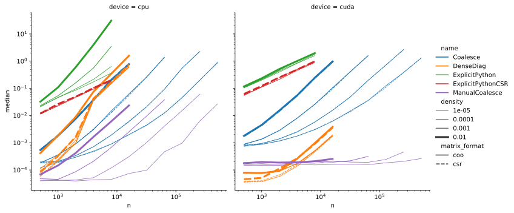

# Benchmark extraction of diagonal entries of a sparse matrix
This repository contains benchmarking results for different ways to extract diagonal entries from a sparse matrix in
PyTorch.

## Background
This repository originates from implementing the *Random Walk Positional Encoding* from
[Dwivedi et al., 2022](https://arxiv.org/abs/2110.07875) in PyTorch for
[pykeen#918](https://github.com/pykeen/pykeen/pull/918).
This positional encoding is given as 
```
x_i = [R[i, i], R^2[i, i], ..., R^k[i, i]]
```
where `R = AD^{-1}` denotes the column-wise normalized adjacency matrix. Since typically adjacency matrices are
sparse, we want to use [`torch.sparse`](https://pytorch.org/docs/stable/sparse.html) for calculating the [matrix
powers.](https://github.com/pykeen/pykeen/blob/9025a7171f561d964652263269c751cf44b208d7/src/pykeen/nn/utils.py#L95-L116)
As of PyTorch 1.11, sparse matrices are in beta status and not all operations support sparse matrices.
Particularly, [`torch.diagonal`](https://pytorch.org/docs/stable/generated/torch.diagonal.html) does not support
sparse matrices,
```python-console
>>> torch.diagonal(A)
Traceback (most recent call last):
  File "<stdin>", line 1, in <module>
RuntimeError: sparse tensors do not have strides
```
nor can we use advanced indexing via `A[torch.arange(n), torch.arange(n)]`
<details>

```python-console
>>> A[torch.arange(n), torch.arange(n)]
Traceback (most recent call last):
  File "<stdin>", line 1, in <module>
NotImplementedError: Could not run 'aten::index.Tensor' with arguments from the 'SparseCPU' backend. This could be because the operator doesn't exist for this backend, or was omitted during the selective/custom build process (if using custom build). If you are a Facebook employee using PyTorch on mobile, please visit https://fburl.com/ptmfixes for possible resolutions. 'aten::index.Tensor' is only available for these backends: [CPU, QuantizedCPU, BackendSelect, Python, Named, Conjugate, Negative, ZeroTensor, ADInplaceOrView, AutogradOther, AutogradCPU, AutogradCUDA, AutogradXLA, AutogradLazy, AutogradXPU, AutogradMLC, AutogradHPU, AutogradNestedTensor, AutogradPrivateUse1, AutogradPrivateUse2, AutogradPrivateUse3, Tracer, AutocastCPU, Autocast, Batched, VmapMode, Functionalize].

CPU: registered at aten/src/ATen/RegisterCPU.cpp:21063 [kernel]
QuantizedCPU: registered at aten/src/ATen/RegisterQuantizedCPU.cpp:1258 [kernel]
BackendSelect: fallthrough registered at ../aten/src/ATen/core/BackendSelectFallbackKernel.cpp:3 [backend fallback]
Python: registered at ../aten/src/ATen/core/PythonFallbackKernel.cpp:47 [backend fallback]
Named: registered at ../aten/src/ATen/core/NamedRegistrations.cpp:7 [backend fallback]
Conjugate: registered at ../aten/src/ATen/ConjugateFallback.cpp:18 [backend fallback]
Negative: registered at ../aten/src/ATen/native/NegateFallback.cpp:18 [backend fallback]
ZeroTensor: registered at ../aten/src/ATen/ZeroTensorFallback.cpp:86 [backend fallback]
ADInplaceOrView: fallthrough registered at ../aten/src/ATen/core/VariableFallbackKernel.cpp:64 [backend fallback]
AutogradOther: registered at ../torch/csrc/autograd/generated/VariableType_1.cpp:10665 [autograd kernel]
AutogradCPU: registered at ../torch/csrc/autograd/generated/VariableType_1.cpp:10665 [autograd kernel]
AutogradCUDA: registered at ../torch/csrc/autograd/generated/VariableType_1.cpp:10665 [autograd kernel]
AutogradXLA: registered at ../torch/csrc/autograd/generated/VariableType_1.cpp:10665 [autograd kernel]
AutogradLazy: registered at ../torch/csrc/autograd/generated/VariableType_1.cpp:10665 [autograd kernel]
AutogradXPU: registered at ../torch/csrc/autograd/generated/VariableType_1.cpp:10665 [autograd kernel]
AutogradMLC: registered at ../torch/csrc/autograd/generated/VariableType_1.cpp:10665 [autograd kernel]
AutogradHPU: registered at ../torch/csrc/autograd/generated/VariableType_1.cpp:10665 [autograd kernel]
AutogradNestedTensor: registered at ../torch/csrc/autograd/generated/VariableType_1.cpp:10665 [autograd kernel]
AutogradPrivateUse1: registered at ../torch/csrc/autograd/generated/VariableType_1.cpp:10665 [autograd kernel]
AutogradPrivateUse2: registered at ../torch/csrc/autograd/generated/VariableType_1.cpp:10665 [autograd kernel]
AutogradPrivateUse3: registered at ../torch/csrc/autograd/generated/VariableType_1.cpp:10665 [autograd kernel]
Tracer: registered at ../torch/csrc/autograd/generated/TraceType_1.cpp:11342 [kernel]
AutocastCPU: fallthrough registered at ../aten/src/ATen/autocast_mode.cpp:461 [backend fallback]
Autocast: fallthrough registered at ../aten/src/ATen/autocast_mode.cpp:305 [backend fallback]
Batched: registered at ../aten/src/ATen/BatchingRegistrations.cpp:1059 [backend fallback]
VmapMode: fallthrough registered at ../aten/src/ATen/VmapModeRegistrations.cpp:33 [backend fallback]
Functionalize: registered at ../aten/src/ATen/FunctionalizeFallbackKernel.cpp:52 [backend fallback]
```
</details>

Hence, we study different variants of extracting the diagonal and measure their performance.
  
## Variants

### Overview

| \# | Variant | COO | CSR |
| -- | -- | :--:| :--: |
| 1 | DenseDiag | ✓ | ✓ |
| 2 | ExplicitPython | ✓ |  |
| 3 | ExplicitPythonCSR |  | ✓ |
| 4 | Coalesce | ✓ |  |
| 5 | ManualCoalesce | ✓ |  |
  
### Details

1. [`torch.diagonal`](https://pytorch.org/docs/stable/generated/torch.diagonal.html) on the dense
  version of the matrix, obtained via
  [`torch.Tensor.to_dense`](https://pytorch.org/docs/stable/generated/torch.Tensor.to_dense.html).
  Due to materializing the dense matrix, this method requires a large amount of memory (O(n^2)).
  It is applicable for both, COO and CSR format.
```python
d = torch.diagonal(matrix.to_dense())
```
  
2. Python for-loop, and item access. Due to using a Python loop, this variant is likely to be
  inefficient. Moreover, it is only applicable to the COO-format, an fails for CSR adjacency
  matrices (cf. details collapsible)
```python
n = matrix.shape[0]
d = torch.zeros(n, device=matrix.device)
for i in range(n):
    d[i] = matrix[i, i]
```
<details>

```python-traceback
Traceback (most recent call last):
    d[i] = matrix[i, i]
NotImplementedError: Could not run 'aten::as_strided' with arguments from the 'SparseCsrCPU' backend. This could be because the operator doesn't exist for this backend, or was omitted during the selective/custom build process (if using custom build). If you are a Facebook employee using PyTorch on mobile, please visit https://fburl.com/ptmfixes for possible resolutions. 'aten::as_strided' is only available for these backends: [CPU, Meta, QuantizedCPU, BackendSelect, Python, Named, Conjugate, Negative, ZeroTensor, ADInplaceOrView, AutogradOther, AutogradCPU, AutogradCUDA, AutogradXLA, AutogradLazy, AutogradXPU, AutogradMLC, AutogradHPU, AutogradNestedTensor, AutogradPrivateUse1, AutogradPrivateUse2, AutogradPrivateUse3, Tracer, AutocastCPU, Autocast, Batched, VmapMode, Functionalize].

CPU: registered at aten/src/ATen/RegisterCPU.cpp:21063 [kernel]
Meta: registered at aten/src/ATen/RegisterMeta.cpp:14951 [kernel]
QuantizedCPU: registered at aten/src/ATen/RegisterQuantizedCPU.cpp:1258 [kernel]
BackendSelect: fallthrough registered at ../aten/src/ATen/core/BackendSelectFallbackKernel.cpp:3 [backend fallback]
Python: registered at ../aten/src/ATen/core/PythonFallbackKernel.cpp:47 [backend fallback]
Named: fallthrough registered at ../aten/src/ATen/core/NamedRegistrations.cpp:11 [kernel]
Conjugate: fallthrough registered at ../aten/src/ATen/ConjugateFallback.cpp:22 [kernel]
Negative: fallthrough registered at ../aten/src/ATen/native/NegateFallback.cpp:22 [kernel]
ZeroTensor: registered at aten/src/ATen/RegisterZeroTensor.cpp:167 [kernel]
ADInplaceOrView: registered at ../torch/csrc/autograd/generated/ADInplaceOrViewType_0.cpp:2566 [kernel]
AutogradOther: registered at ../torch/csrc/autograd/generated/VariableType_0.cpp:9932 [autograd kernel]
AutogradCPU: registered at ../torch/csrc/autograd/generated/VariableType_0.cpp:9932 [autograd kernel]
AutogradCUDA: registered at ../torch/csrc/autograd/generated/VariableType_0.cpp:9932 [autograd kernel]
AutogradXLA: registered at ../torch/csrc/autograd/generated/VariableType_0.cpp:9932 [autograd kernel]
AutogradLazy: registered at ../torch/csrc/autograd/generated/VariableType_0.cpp:9932 [autograd kernel]
AutogradXPU: registered at ../torch/csrc/autograd/generated/VariableType_0.cpp:9932 [autograd kernel]
AutogradMLC: registered at ../torch/csrc/autograd/generated/VariableType_0.cpp:9932 [autograd kernel]
AutogradHPU: registered at ../torch/csrc/autograd/generated/VariableType_0.cpp:9932 [autograd kernel]
AutogradNestedTensor: registered at ../torch/csrc/autograd/generated/VariableType_0.cpp:9932 [autograd kernel]
AutogradPrivateUse1: registered at ../torch/csrc/autograd/generated/VariableType_0.cpp:9932 [autograd kernel]
AutogradPrivateUse2: registered at ../torch/csrc/autograd/generated/VariableType_0.cpp:9932 [autograd kernel]
AutogradPrivateUse3: registered at ../torch/csrc/autograd/generated/VariableType_0.cpp:9932 [autograd kernel]
Tracer: registered at ../torch/csrc/autograd/generated/TraceType_0.cpp:11618 [kernel]
AutocastCPU: fallthrough registered at ../aten/src/ATen/autocast_mode.cpp:461 [backend fallback]
Autocast: fallthrough registered at ../aten/src/ATen/autocast_mode.cpp:305 [backend fallback]
Batched: registered at ../aten/src/ATen/BatchingRegistrations.cpp:1063 [kernel]
VmapMode: fallthrough registered at ../aten/src/ATen/VmapModeRegistrations.cpp:33 [backend fallback]
Functionalize: registered at aten/src/ATen/RegisterFunctionalization_0.cpp:4018 [kernel]  
```
</details>

3. Python for-loop (CSR): Here, we iterate over the rows, select the corresponding column indices, and
  determine, whether one of them corresponds to the diagonal entry. In that case, we select the
  corresponding value and copy it into the result.
```python
n = matrix.shape[0]
d = torch.zeros(n, device=matrix.device)

crow = matrix.crow_indices()
col = matrix.col_indices()
values = matrix.values()

for i, (start, stop) in enumerate(zip(crow, crow[1:])):
    this_col = col[start:stop]
    this_values = values[start:stop]
    v = this_values[this_col == i]
    if v.numel():
        d[i] = v
```
  
4. Coalesce: In this variant, we perform an element-wise multiplication with a sparse identity
  matrix, and then use [`torch.Tensor.values`](https://pytorch.org/docs/stable/generated/torch.Tensor.values.html)
  and [`torch.Tensor.indices`](https://pytorch.org/docs/stable/generated/torch.Tensor.indices.html)
  to obtain the values and indices of non-zero elements. This operation does only support the COO format.
  Moreover, it requires a coalesced sparse COO tensor, i.e., a prior call to
  [`torch.Tensor.coalesce`](https://pytorch.org/docs/stable/generated/torch.Tensor.coalesce.html).
```python
n = matrix.shape[0]
d = torch.zeros(n, device=matrix.device)

d_sparse = (matrix * eye).coalesce()
indices = d_sparse.indices()
values = d_sparse.values()
d[indices] = values
```

5. Manual Coalesce: Since the most expensive part of the previous solution is the coalesce step,
  we investigate a variant with directly operates on the raw, uncoalesced `_values` and `_indices`.
  Hereby, we avoid having to coalesce non-diagonal entries. Since we operate on the uncoalesced
  view, there may be multiple entries for the same index, we need to be aggregated via
  [`scatter_add_`](https://pytorch.org/docs/stable/generated/torch.Tensor.scatter_add_.html).
```python
n = matrix.shape[0]
d = torch.zeros(n, device=matrix.device)

indices = matrix._indices()
mask = indices[0] == indices[1]
diagonal_values = matrix._values()[mask]
diagonal_indices = indices[0][mask]

d = d.scatter_add(dim=0, index=diagonal_indices, src=diagonal_values)
```
## Experiments
### Environment
The experiments were conducted on synthethic sparse adjacency matrices of varying sizes
(500 - 512.000 nodes) and densities (0.001% - 1% non-zero entries). The matrices may not fully
be fully representative for natural adjacency matrices, since the non-zero indices were chosen
uniformly random. Moreover, we did not guarantee that there are no repetitions of indices, i.e.,
the coalesced matrices may be sparser than the original ones.
  
For measuring execution times, we used [PyTorch's built-in benchmarking utilities
](https://pytorch.org/docs/stable/benchmark_utils.html), which ensure proper
device synchronization and warm-up phases for experiments with GPUs.
  
The experiments were conducted on a Server on Ubuntu 20.04 with a
Intel(R) Xeon(R) Gold 5218 CPU @ 2.30GHz with 64 cores, one RTX8000 GPU. We used PyTorch 1.11
for our experiments. We did not investigate the scaling effects in terms of the number of CPU threads,
and left these on their default, i.e., CPU numbers are for single-core.

After some initial experiments with smaller adjacency matrices, we decided to run only the
top-performing variants on the larger matrices. Moreover, we also limited the size for experiments
with densification due to the excessive memory requirement. Finally, we decided to exclude experiments
where matrices have more than 10M non-zero entries (i.e., for the largest matrix sizes, we only
considered the sparser variants).
  
## Results

The following plot shows the median runtime in seconds for the different approaches for various
matrix sizes and densities.
  

  
Overall, we observe, as expected, increasing runtime with matrix size and density.
Approaches relying on Python for-loops exhibit the worst scaling behaviour, likely due to the
overhead of Python loops compared to the other variants, where the looping happens inside PyTorch.
On GPU, the densification approach is competitive in terms of runtime on smaller matrices, but
it faces a quadratic memory complexity. The manual coalescing approach performs best and is up
to multiple orders of magnitude faster than the full coalescing.
  
While it accesses private methods of sparse tensors (which themselves are considered to be beta
as of PyTorch 1.11), and thus may break with future releases, the effort of exchanging it by any
of the other existing implementations, or even better a variant build into PyTorch, is neglicible.
We thus opt for using the manual coalescing approach for
[PyKEEN#918](https://github.com/pykeen/pykeen/pull/918).
